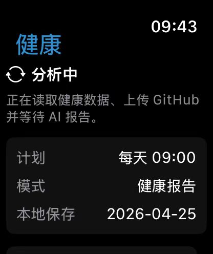
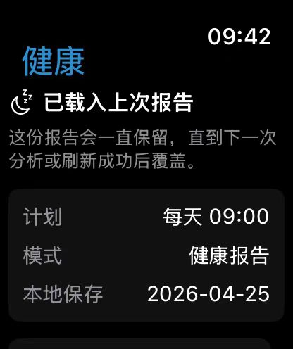
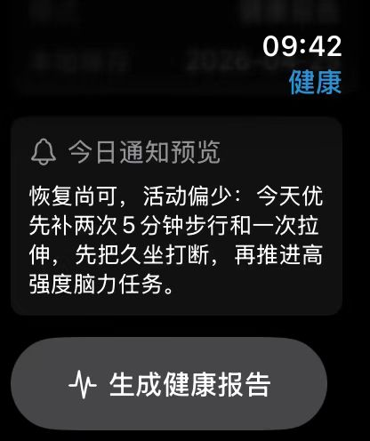
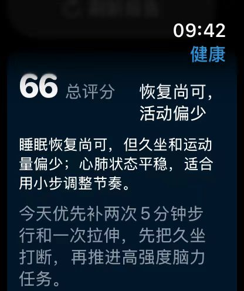
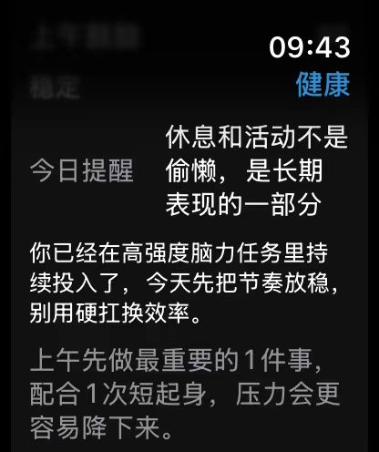
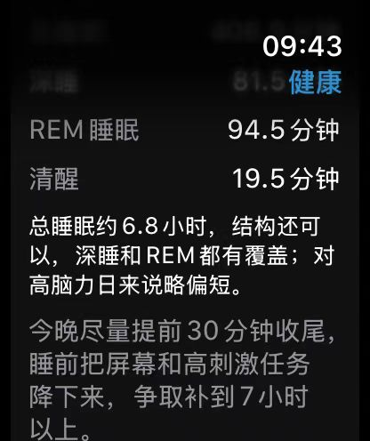
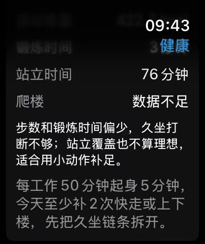
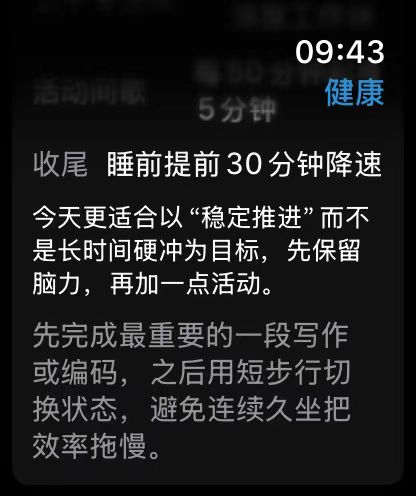

# Apple Watch AI Health Coach

Welcome to fork this project and add a star if it helps you!

Apple Watch AI Health Coach is a native watchOS app that turns Apple Watch / HealthKit data into a personalized daily health report. It combines sleep, activity, heart rate, HRV, respiratory, oxygen saturation, stand, distance, energy, and other available Watch health signals, then sends the data to GitHub Actions for encrypted, self-hosted AI analysis.

The key idea is personalization. After you provide your own background through a private GitHub Secret, such as your work environment, study or work pressure, lifestyle, sleep habits, exercise goals, and preferred coaching tone, the workflow calls OpenAI or any OpenAI-compatible API to generate a report tailored specifically for you. The report is not a generic health summary; it is a customized interpretation of your own Watch data and your own life context.

You can also extend it in your own direction. With Codex or your preferred coding workflow, this project can be customized to add new notification options, new report sections, new health modules, different prompts, custom scoring rules, extra UI views, or summaries that combine Apple Watch data with other apps and personal data sources.

This project is self-hosted. Every user configures their own GitHub repository, GitHub Actions secrets, OpenAI-compatible API key, encryption key, Apple Developer signing, and Apple Watch app settings. No personal data, API keys, GitHub tokens, HealthKit exports, or user-specific prompt text are included in this repository.

## Watch App Screenshots

| Analysis flow | Cached report | Notification preview | Overall score |
| --- | --- | --- | --- |
|  |  |  |  |
| Reads health data, uploads it to GitHub Actions, and waits for the AI report. | Keeps the latest successful report on the Watch until the next successful refresh. | Shows the report summary that will be used for the local Watch notification. | Presents the personalized overall health score, assessment, and top recommendation. |

| Daily reminder | Sleep recovery | Activity and sitting | Focus plan |
| --- | --- | --- | --- |
|  |  |  |  |
| Gives a personal morning reminder based on the user's context and recent data. | Summarizes sleep duration, REM, awake time, and recovery recommendations. | Reviews steps, standing time, stairs, and sedentary-work recovery suggestions. | Turns the report into a practical workday plan with rest, movement, and focus guidance. |

## Features

- Reads comprehensive Apple Watch / HealthKit signals, including sleep, activity, heart rate, HRV, respiratory rate, oxygen saturation, stand hours, distance, flights climbed, exercise time, and active energy.
- Triggers a GitHub Actions workflow from Apple Watch.
- Uses OpenAI or any OpenAI-compatible API to generate a structured Chinese health report.
- Uses a private `USER_PERSONA` GitHub Secret to personalize the report around your work environment, lifestyle, stress level, exercise habits, recovery needs, and preferred tone.
- Produces a report that is designed for you, not a one-size-fits-all template.
- Stores only AES-256-GCM encrypted reports in `reports/*.json.enc`.
- Does not commit raw HealthKit payloads, plaintext JSON reports, or Markdown summaries.
- Sends a local Apple Watch notification after the encrypted report is fetched and decrypted.
- Schedules a local 09:00 watchOS background refresh when watchOS allows it.

## How It Works

1. Apple Watch reads HealthKit data locally.
2. Apple Watch triggers `.github/workflows/sleep-analysis.yml` with the health payload.
3. GitHub Actions calls the configured OpenAI-compatible API.
4. The generated report is encrypted with `HEALTH_REPORT_KEY`.
5. GitHub Actions commits only `reports/YYYY-MM-DD.json.enc`.
6. Apple Watch downloads the encrypted report, decrypts it locally with the same key, and shows the report in the app and notification.

## Privacy Model

- Use one repository per user. Do not share one configured repository between multiple people.
- Raw HealthKit data is sent to GitHub Actions so the workflow can process it.
- The configured model provider can process the raw payload during analysis.
- Personal prompt/profile text is not sent from the Watch app. Store it only as the `USER_PERSONA` GitHub Actions secret.
- The repository should only contain encrypted report files: `reports/*.json.enc`.
- Never commit `OPENAI_API_KEY`, the Watch GitHub token, `HEALTH_REPORT_KEY`, or personal prompt text.
- Treat GitHub Actions logs as sensitive operational logs. The workflow is designed not to print raw HealthKit payloads.
- If you accidentally commit a secret, rotate it immediately.

## Requirements

- macOS with Xcode installed.
- Apple Watch with Developer Mode enabled.
- An Apple ID that can sign and run watchOS apps on your Apple Watch.
- A GitHub account and a repository created from this project.
- An OpenAI-compatible API endpoint and API key.
- Basic command-line tools: `git`, `python3`, and optionally `gh`.

## Quick Start

Clone your own copy:

```bash
git clone https://github.com/YOUR_USER/YOUR_REPOSITORY.git
cd YOUR_REPOSITORY
```

Open the project:

```bash
open SleepWatch.xcodeproj
```

Then complete the GitHub, local config, and Xcode setup below.

## GitHub Repository Setup

Create your own repository from this project by forking it, using it as a template, or pushing a copy to a new repository.

If this project helps you, please consider starring the original repository so more Apple Watch users can find it.

Recommended: keep the repository private unless you understand the privacy tradeoffs. The app can work with a public repository because reports are encrypted, but private is still safer for personal health workflows.

## GitHub Actions Secrets

Open your repository on GitHub:

`Settings` -> `Secrets and variables` -> `Actions` -> `Secrets` -> `New repository secret`

Add these secrets:

| Secret name | Required | Value |
| --- | --- | --- |
| `OPENAI_API_KEY` | Yes | Your OpenAI-compatible API key. |
| `HEALTH_REPORT_KEY` | Yes | Base64-encoded 32-byte AES key. The Watch app must use the same value. |
| `USER_PERSONA` | Recommended | Private personalization text for the report prompt. |

Example `USER_PERSONA` values:

```text
Desk-based software developer who wants posture, movement, sleep recovery, and stress-management suggestions.
```

```text
Student preparing for exams who prefers encouraging language, realistic rest advice, and small daily action plans.
```

Do not put `USER_PERSONA` in `SleepWatch/Config.swift`. Keep it in GitHub Secrets.

## GitHub Actions Variables

Open:

`Settings` -> `Secrets and variables` -> `Actions` -> `Variables` -> `New repository variable`

Add these variables:

| Variable name | Required | Example value |
| --- | --- | --- |
| `OPENAI_API_BASE` | Yes | `https://api.openai.com/v1` |
| `OPENAI_MODEL` | Yes | `gpt-5.4-mini` |
| `OPENAI_WIRE_API` | Yes | `responses` |
| `OPENAI_DISABLE_RESPONSE_STORAGE` | Recommended | `true` |
| `OPENAI_REASONING_EFFORT` | Optional | `xhigh` |

Use the API base URL, model name, and wire API required by your provider.

## Generate The Report Encryption Key

`HEALTH_REPORT_KEY` must be the same in two places:

- GitHub Actions secret `HEALTH_REPORT_KEY`
- Local Watch app config value `reportEncryptionKey`

You can generate one with:

```bash
python3 - <<'PY'
import base64, secrets
print(base64.b64encode(secrets.token_bytes(32)).decode())
PY
```

Copy the printed value into GitHub Secret `HEALTH_REPORT_KEY`.

You will also paste the same value into `SleepWatch/Config.swift`, or let `scripts/set_watch_token.py` generate/store it locally.

## Create The Watch GitHub Token

The Watch app needs a GitHub token so it can trigger the workflow and fetch encrypted reports.

Create a fine-grained personal access token:

1. Open GitHub `Settings` -> `Developer settings` -> `Personal access tokens` -> `Fine-grained tokens`.
2. Click `Generate new token`.
3. Select only your repository.
4. Set repository permissions:
   - `Actions`: `Read and write`
   - `Contents`: `Read-only`
5. Generate the token and copy it.

Do not use your OpenAI API key here. This token is only for GitHub.

## Local Watch App Config

Open:

```text
SleepWatch/Config.swift
```

Fill these fields:

```swift
static let githubOwner = "YOUR_GITHUB_USERNAME"
static let githubRepo = "YOUR_REPOSITORY_NAME"
static let githubBranch = "main"
static let githubToken = "YOUR_FINE_GRAINED_GITHUB_TOKEN"
static let reportEncryptionKey = "YOUR_BASE64_32_BYTE_HEALTH_REPORT_KEY"
```

`githubToken` and `reportEncryptionKey` are local secrets. Do not commit your edited `SleepWatch/Config.swift`.

You can use the helper script to store the GitHub token and mark `Config.swift` as local-only:

```bash
python3 scripts/set_watch_token.py
```

After running it, verify Git ignores local config changes:

```bash
git ls-files -v SleepWatch/Config.swift
```

If the output starts with `S`, Git is treating the file as local-only.

## Xcode Setup

1. Open `SleepWatch.xcodeproj`.
2. Select target `SleepWatch`.
3. Open `Signing & Capabilities`.
4. Set your Apple Developer Team.
5. Change the Bundle Identifier to a unique value, for example:

```text
com.yourname.sleepwatch
```

6. Keep HealthKit enabled.
7. Connect and unlock your Apple Watch.
8. Enable Developer Mode on Apple Watch if Xcode asks for it.
9. Select your Apple Watch as the run destination.
10. Press Run.
11. On first launch, grant HealthKit and notification permissions.

If Xcode says the watch needs to be unlocked or prepared, keep the watch unlocked, near the Mac, and try again.

## Manual Test From The Watch

Open the app on Apple Watch and tap `生成健康报告`.

Expected behavior:

1. The app uploads the health payload to GitHub Actions.
2. The workflow runs in your repository.
3. A file like `reports/YYYY-MM-DD.json.enc` is committed.
4. The Watch app fetches and decrypts that encrypted file.
5. The app shows the report and posts a local notification.

If the report is not ready immediately, wait a few minutes and tap again.

## Manual GitHub Actions Test

You can also test the workflow manually:

1. Open your repository on GitHub.
2. Go to `Actions`.
3. Select `Sleep Analysis`.
4. Click `Run workflow`.
5. Paste a payload like this:

```json
{
  "analysis_date": "2099-01-01",
  "window_start": "2098-12-31T00:00:00Z",
  "window_end": "2099-01-01T00:00:00Z",
  "sleep_window_start": "2098-12-31T18:00:00Z",
  "sleep_window_end": "2099-01-01T12:00:00Z",
  "generated_at": "2099-01-01T09:00:00Z",
  "source": "manual_test",
  "sleep_samples": [
    {
      "stage": "asleep_core",
      "start": "2098-12-31T23:30:00Z",
      "end": "2099-01-01T05:30:00Z",
      "duration_minutes": 360,
      "raw_value": 3
    }
  ],
  "quantity_metrics": [
    {
      "id": "steps",
      "title": "Steps",
      "unit": "steps",
      "aggregation": "sum",
      "value": 6000,
      "average": null,
      "minimum": null,
      "maximum": null,
      "sample_count": 1,
      "start": "2098-12-31T00:00:00Z",
      "end": "2099-01-01T00:00:00Z"
    }
  ],
  "stand_hours": [],
  "data_gaps": []
}
```

The workflow should finish by committing an encrypted file under `reports/`.

## Daily Behavior

The app schedules a background refresh for local 09:00 and tries to upload the previous day's health data. watchOS background refresh is opportunistic, so it may not run at the exact minute every day.

The `生成健康报告` button forces an analysis run when the app is open.

The Watch app keeps only the latest successful report locally. It displays that report when the app opens and keeps it visible until the next successful analysis or refresh replaces it. It does not keep a multi-day local history.

The notification uses the fixed identifier `daily-health-summary`, so each new notification replaces the previous delivered notification.

## Repository Rename

You can rename the repository at any time. Existing GitHub stars, issues, Actions secrets, variables, and workflow history stay with the repository, and GitHub usually redirects the old URL.

After renaming, update:

```bash
git remote set-url origin https://github.com/YOUR_USER/NEW_REPOSITORY_NAME.git
```

Then update `githubRepo` in `SleepWatch/Config.swift`, rebuild, and reinstall the Watch app.

If your fine-grained token stops working after the rename, edit or recreate the token and confirm it still has access to the renamed repository.

## Troubleshooting

### GitHub request failed with HTTP 401

The Watch GitHub token is missing, expired, invalid, or does not have access to the repository.

Fix:

- Recreate the fine-grained token.
- Confirm repository access is set to this repository.
- Confirm `Actions: Read and write`.
- Confirm `Contents: Read-only`.
- Put the token in `SleepWatch/Config.swift`.
- Rebuild and reinstall the Watch app.

### GitHub Action fails with missing secret

Check repository secrets:

- `OPENAI_API_KEY`
- `HEALTH_REPORT_KEY`
- `USER_PERSONA` if you want personalization

### Watch cannot decrypt report

`HEALTH_REPORT_KEY` in GitHub Secrets and `reportEncryptionKey` in `SleepWatch/Config.swift` do not match.

Fix:

- Generate one base64 32-byte key.
- Put the exact same value in both places.
- Run the workflow again.

### No report file appears

Check:

- GitHub Actions is enabled for the repository.
- The workflow has `contents: write` permission.
- The OpenAI-compatible API variables are correct.
- The workflow run did not fail.

### Xcode cannot run on Apple Watch

Check:

- Apple Watch is unlocked and near the Mac.
- Developer Mode is enabled.
- The Bundle Identifier is unique.
- Signing Team is selected.
- Apple Watch and iPhone trust this Mac if prompted.

## Security Checklist Before Sharing

Before making your configured repository public, confirm:

- `SleepWatch/Config.swift` does not contain your real GitHub token.
- No OpenAI API key is committed.
- No `HEALTH_REPORT_KEY` is committed.
- No personal prompt/profile text is committed.
- No raw HealthKit payloads are committed.
- No plaintext report files are committed.
- Only encrypted report files may exist under `reports/*.json.enc`.
- Old GitHub Actions runs that may contain sensitive inputs have been deleted if needed.

Recommended for open source: publish an unconfigured template repository, and let each user configure their own fork or copy.
